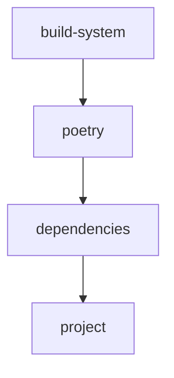

# pyproject.toml

> Language: text | Size: 642 bytes

## Model qwen3:8b

### 1. Purpose Summary  
The `pyproject.toml` file defines the build configuration and metadata for the **Euler-Maths** project. Its primary purpose is to:  
- Specify the project's name, version, and author details.  
- Declare dependencies (e.g., `numpy`, `bitarray`) required for mathematical operations.  
- Configure the build system using **Hatchling** to package and distribute the library.  
- Provide metadata for package classification (e.g., Python 3.8+ compatibility, MIT license).  

---

### 2. Key Functions/Classes and Collaboration  
The `pyproject.toml` file itself does **not** define functions or classes. It serves as a metadata and build configuration file. However, the project's code (not shown here) likely includes:  
- **Mathematical utilities** for solving Project Euler problems (e.g., prime checks, number theory functions).  
- **Collaboration with dependencies**:  
  - **`numpy`**: Handles numerical computations (e.g., array operations, optimizations).  
  - **`bitarray`**: Manages bit-level operations (e.g., binary manipulations for problems involving bits).  

The build system (**Hatchling**) ensures the package is correctly packaged and distributed, enabling users to install and use the library via `pip`.

---

### 3. External Dependencies or APIs Used  
- **`numpy`**: For numerical operations and array manipulations.  
- **`bitarray`**: For efficient bit-level operations.  
- **`hatchling`**: As the build backend for packaging the project.  
- **GitHub**: Hosts the project's source code and issue tracking (via URLs in the `project.urls` section).  

No direct API integrations are declared in the `pyproject.toml`.

## Detected Imports

None detected.

## Function Diagram

