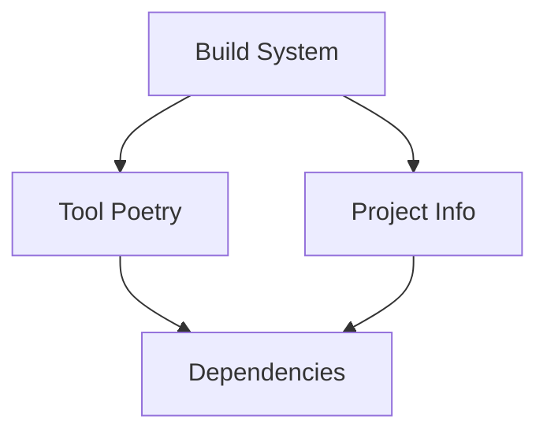

# pyproject.toml

> Language: text | Size: 642 bytes

## Model qwen3:8b

### 1. **Purpose Summary**  
The `pyproject.toml` file defines the build configuration and metadata for the **Euler-Maths** project. Its primary purpose is to:  
- Specify the project's name, version, and author information.  
- Declare dependencies (e.g., `numpy`, `bitarray`) required for mathematical operations.  
- Configure the build system using **Hatchling** (via `hatchling.build`).  
- Provide metadata for package distribution, licensing, and project URLs.  

---

### 2. **Key Functions/Classes and Collaboration**  
The `pyproject.toml` file itself does **not** contain code or functions. However, it indirectly defines the **collaboration between components** in the project:  
- **Build System**: Hatchling is used to package and build the project, ensuring compatibility with Python 3.8+.  
- **Dependencies**:  
  - **`numpy`**: Likely used for numerical computations (e.g., array operations, linear algebra).  
  - **`bitarray`**: Likely used for bit manipulation tasks (e.g., prime sieves, bitmask algorithms).  
- **Project Structure**: The library's core functions (e.g., prime generation, number theory utilities) collaborate with these dependencies to optimize performance for Project Euler problems.  

---

### 3. **External Dependencies or APIs Used**  
- **`hatchling`**: Build tool for packaging and distributing the Python library.  
- **`numpy`**: Scientific computing library for numerical operations.  
- **`bitarray`**: Library for efficient bit manipulation.  
- **License**: MIT License (per the classifiers).  
- **Project URLs**:  
  - Homepage: [GitHub Repository](https://github.com/Luke943/Euler-Maths)  
  - Bug Tracker: [GitHub Issues](https://github.com/Luke943/Euler-Maths/issues)  

---

### Notes  
The file does **not** include code or imports directly. It serves as a metadata and build configuration file, while the actual mathematical functions and their collaboration with dependencies are defined in the project's source code.

## Detected Imports

None detected.

## Function Diagram

```mermaid
graph TD
    A[Build System] --> B[Project Info]
    A --> C[Tool Poetry]
    C --> D[Dependencies]
    B --> D
```
