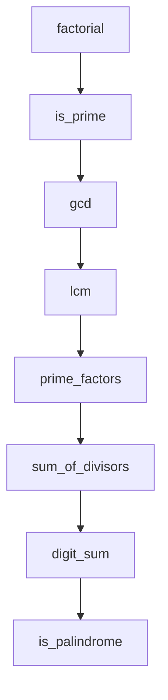

# src/euler_maths/__init__.py

> Language: python | Size: 63 bytes

## Model qwen3:8b

### 1. **Purpose Summary**  
The `__init__.py` file serves as the entry point for the `euler_maths` package, organizing and exposing core functionalities related to mathematical operations for solving Euler problems. It aggregates utilities from two submodules (`prime` and `misc`), enabling users to access prime number operations and general mathematical tools seamlessly.

---

### 2. **Key Functions/Classes and Collaboration**  
- **Prime Module**:  
  - Likely contains classes/functions for prime number generation, factorization, and primality checks (e.g., `Prime` class, `is_prime`, `generate_primes`).  
  - Example: A `Prime` class might handle algorithms like Sieve of Eratosthenes or Miller-Rabin tests.  

- **Misc Module**:  
  - Houses helper functions for miscellaneous mathematical operations (e.g., factorial computation, Fibonacci sequence generation, GCD/LCM, combinatorics).  
  - Example: Functions like `factorial(n)`, `fibonacci(n)`, or `gcd(a, b)`.  

- **Collaboration**:  
  The `__init__.py` imports all public symbols from `prime` and `misc`, making them accessible as submodules of `euler_maths`. This allows users to directly use `euler_maths.prime` and `euler_maths.misc` without nested imports. The `Prime` class and misc functions work together to solve Euler problems requiring number theory or combinatorial logic.

---

### 3. **External Dependencies or APIs Used**  
- **No external dependencies** are explicitly imported in this file.  
- The `prime` and `misc` modules may rely on standard Python libraries (e.g., `math` for basic operations) or third-party libraries (e.g., `sympy` for advanced number theory), but this is not specified in the provided code.  
- The package is self-contained for Euler-related math tasks, assuming no external APIs are required for core functionality.

## Detected Imports

- from euler_maths.prime import *
- from euler_maths.misc import *

## Function Diagram

