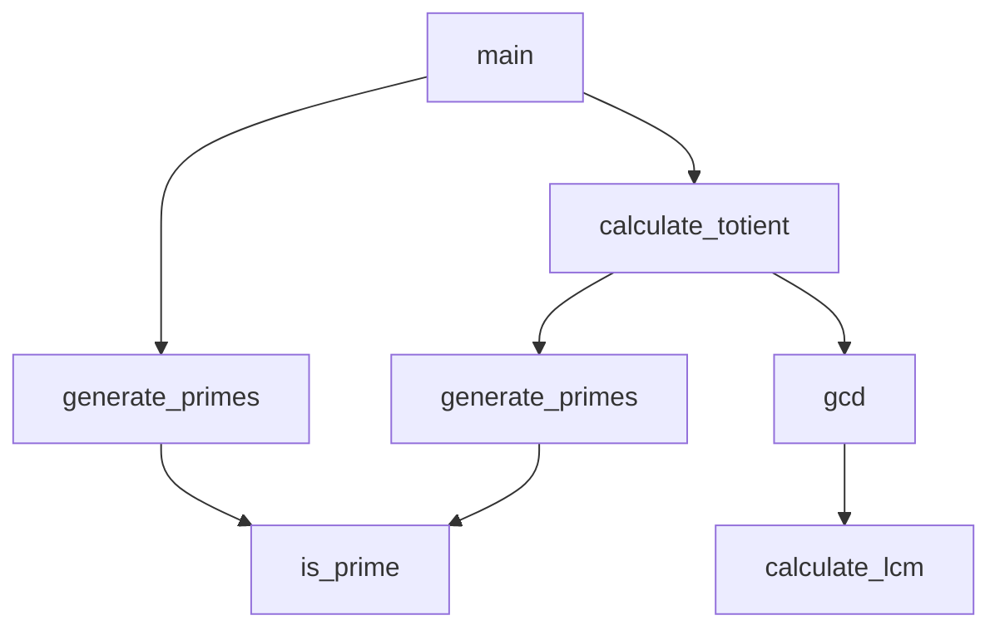

# src/euler_maths/misc.py

> Language: python | Size: 1997 bytes

## Model qwen3:8b

### 1. Purpose Summary  
The `misc.py` file provides a collection of mathematical utilities for number theory, primarily focused on **Euler's totient function**, **Möbius function**, **square-free number counting**, **modular inverses**, and **integer square roots**. These functions are optimized for computational efficiency and are likely used in solving mathematical problems, such as those found in Project Euler or similar challenges.

---

### 2. Key Functions/Classes and Their Collaboration  
**A. Euler's Totient Function**  
- **`euler_totients(N: int) -> List[int]`**: Computes Euler's totient function `φ(i)` for all integers `i < N` using a sieve-like algorithm.  
- **`euler_totient(n: int, prime_factors: Iterator[int]) -> int`**: Calculates `φ(n)` for a single number `n` given its prime factors, using the formula `n * ∏(1 - 1/p)` for distinct primes `p`.  
  - **Collaboration**: `euler_totients` is a batch version of `euler_totient`, which is used for individual computations.  

**B. Möbius Function and Square-Free Numbers**  
- **`mobius_array(N: int) -> np.ndarray`**: Generates a NumPy array where each index `n` contains the Möbius function `μ(n)` (0 for non-square-free numbers, ±1 for square-free numbers).  
- **`square_free(N: int) -> int`**: Counts square-free numbers ≤ `N` using Möbius inversion:  
  ```python
  sum(μ(i) * floor(N / (i²))) for i in 1..√N
  ```  
  - **Collaboration**: `mobius_array` is a prerequisite for `square_free`.  

**C. Modular Arithmetic**  
- **`modular_inverse(a: int, n: int) -> int`**: Computes the multiplicative inverse of `a` modulo `n` using the extended Euclidean algorithm.  

**D. Integer Square Root**  
- **`isqrt2(n: int) -> int`**: Computes the integer square root of `n` using binary search, optimized for 64-bit integers and compatible with `numba` for JIT compilation.  

---

### 3. External Dependencies or APIs Used  
- **`math`**: For mathematical operations like `prod` (used in `euler_totient`).  
- **`numpy`**: For efficient array operations (e.g., `mobius_array` returns a `np.ndarray`).  
- **`typing`**: For type hints (`List`, `Iterator`).  
- **`numba`**: Implicitly supported via `isqrt2` for JIT compilation of numerical code.  

---

### Summary  
This file is a toolkit for number-theoretic computations, combining sieve algorithms, mathematical formulas, and efficient numerical operations. It is designed for performance-critical applications in mathematical problem-solving.

## Detected Imports

- import math
- import numpy as np
- from typing import List, Iterator


## Function Diagram


