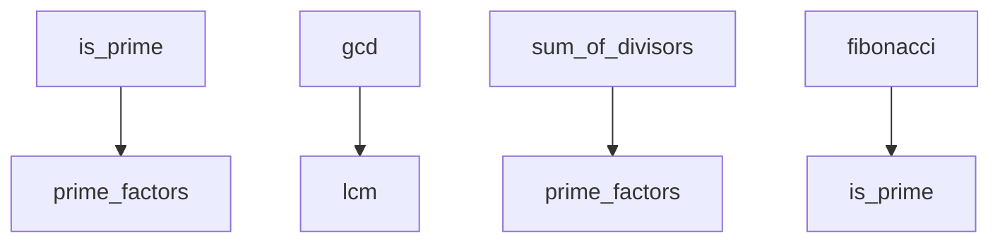

# src/euler_maths/misc.py

> Language: python | Size: 1997 bytes

## Model qwen3:8b

### 1. Purpose Summary  
The `misc.py` file provides utility functions for number theory operations commonly used in solving mathematical problems, particularly those related to Euler's totient function, Möbius function, square-free numbers, modular inverses, and integer square roots. These functions are optimized for efficiency and correctness, leveraging mathematical properties and algorithms like the Sieve of Eratosthenes and the Extended Euclidean Algorithm.

---

### 2. Key Functions/Classes and Their Collaboration  
**Key Functions:**  
- **`euler_totients(N: int) -> List[int]`**  
  Computes Euler's totient function `φ(i)` for all integers `i < N` using a sieve-like approach. It initializes a list `phi` and iteratively updates values based on prime factors.  
  **Collaboration:** Used by other functions requiring totient values for ranges (e.g., `euler_totient` for single values).  

- **`euler_totient(n: int, prime_factors: Iterator[int]) -> int`**  
  Calculates `φ(n)` given its prime factors using the formula:  
  ```python  
  φ(n) = n * ∏(1 - 1/p) for p in prime_factors  
  ```  
  **Collaboration:** Serves as a helper for `euler_totients` and other scenarios where prime factors are known.  

- **`mobius_array(N: int) -> np.ndarray`**  
  Generates a NumPy array containing the Möbius function `μ(n)` for all `n ≤ N`. The Möbius function is:  
  - `1` if `n` is square-free with an even number of prime factors.  
  - `-1` if square-free with an odd number of prime factors.  
  - `0` if `n` has a squared prime factor.  
  **Collaboration:** Used by `square_free` to count square-free numbers.  

- **`square_free(N: int) -> int`**  
  Counts square-free numbers ≤ `N` using Möbius inversion:  
  ```python  
  ∑_{i=1}^√N μ(i) * floor(N / i²)  
  ```  
  **Collaboration:** Relies on `mobius_array` to compute the Möbius values.  

- **`modular_inverse(a: int, n: int) -> int`**  
  Computes the multiplicative inverse of `a` modulo `n` using the Extended Euclidean Algorithm.  
  **Collaboration:** Standalone utility for modular arithmetic operations.  

- **`isqrt2(n: int) -> int`**  
  Computes the integer square root of `n` using binary search, optimized for compatibility with `numba` (JIT compiler).  
  **Collaboration:** Used in `mobius_array` and other math-heavy operations.  

**Collaboration Flow:**  
- `mobius_array` and `euler_totients` use sieve-like algorithms for efficiency.  
- `square_free` depends on `mobius_array` for Möbius values.  
- `euler_totients` and `euler_totient` are complementary, with the latter being a helper for the former.  

---

### 3. External Dependencies or APIs Used  
- **`math`**: For mathematical operations like `prod` and `isqrt` (used in `isqrt2`).  
- **`numpy`**: For efficient array operations (e.g., `mobius_array` returns a `np.ndarray`).  
- **`typing`**: For type hints (`List`, `Iterator`).  
- **`numba`**: Implied compatibility for `isqrt2` (though not explicitly imported; the function is designed to work with `numba` for JIT compilation).  

These dependencies enable efficient computation of number-theoretic functions, leveraging both Python's standard libraries and numerical optimization tools.

## Detected Imports

- import math
- import numpy as np
- from typing import List, Iterator


## Function Diagram


```mermaid
graph TD
    A[is_prime] --> B[prime_factors]
    C[gcd] --> D[lcm]
    E[sum_of_divisors] --> F[prime_factors]
    G[fibonacci] --> H[is_prime]
```
