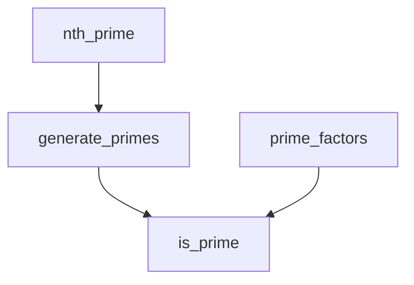

# src/euler_maths/prime.py

> Language: python | Size: 4203 bytes

## Model qwen3:8b

### 1. Purpose Summary  
The `prime.py` file provides utilities for **prime number generation** and **primality testing**, optimized for efficiency and memory usage. It includes sieve algorithms for generating primes, a prime factorization sieve, and a robust Miller-Rabin primality test for large integers. These tools are designed to solve problems related to number theory, such as finding primes, factoring numbers, and verifying primality for large values.

---

### 2. Key Functions/Classes and Their Collaboration  
#### **Core Functions**  
- **`primes(N: int) -> np.ndarray`**  
  Generates all primes < `N` using **Numpy** for memory efficiency. It implements the Sieve of Eratosthenes with optimized numpy operations.  
  **Collaboration**: Uses `np.ones` for a boolean array and numpy slicing to mark non-primes.  

- **`primes_iter(N: int) -> Iterator[int]`**  
  Produces primes < `N` as an **iterator** using **bitarray** for minimal memory usage (~N bits).  
  **Collaboration**: Leverages bitarray's efficient bit manipulation and `itersearch` to yield primes on demand.  

- **`prime_factors(N: int) -> np.ndarray`**  
  Computes **unique prime factors** for all numbers < `N` using a sieve-like approach.  
  **Collaboration**: Uses `np.zeros` to track factor counts and stores factors in a 2D array.  

- **`is_prime(n: int) -> bool`**  
  Main primality test function. Uses:  
  - **`_is_prime_basic`** for small `n` (≤ 1M).  
  - **Miller-Rabin test** for larger `n`, with deterministic bases up to a threshold (~3.3e18) and probabilistic testing beyond.  
  **Collaboration**: Relies on `primes` and `prime_factors` for helper logic.  

- **`_is_prime_basic(n: int) -> bool`**  
  A basic primality test using the **6k±1 optimization** (checks divisibility by 2, 3, and odd numbers up to √n).  
  **Collaboration**: Serves as a fallback for small `n` in `is_prime`.  

#### **Sieve Functions**  
- **`_primes(N: int) -> List[int]`**  
  A deprecated sieve implementation using a list of booleans. Slower and memory-intensive compared to numpy/bitarray versions.  

---

### 3. External Dependencies or APIs Used  
- **`numpy`**: For efficient array operations (e.g., `np.ones`, slicing, and memory optimization).  
- **`bitarray`**: For memory-efficient bit manipulation in the `primes_iter` function.  
- **`random`**: To generate random bases for the probabilistic Miller-Rabin test when `n` exceeds deterministic thresholds.  
- **`typing`**: For type hints (e.g., `List`, `Iterator`).  

---

### Notes on Design Choices  
- **Memory Efficiency**: The numpy and bitarray versions prioritize memory usage (~N bytes or bits) over speed.  
- **Determinism**: The Miller-Rabin test is deterministic for `n < 3.3e18` using fixed bases; beyond that, it uses probabilistic testing.  
- **Scalability**: The `prime_factors` function is optimized for factorization of numbers < 2³¹, leveraging precomputed small primes.  

This file is a comprehensive toolkit for prime-related computations, balancing speed, memory, and correctness for both small and large integers.

## Detected Imports

- import random
- import bitarray
- import numpy as np
- from typing import List, Iterator

## Function Diagram

