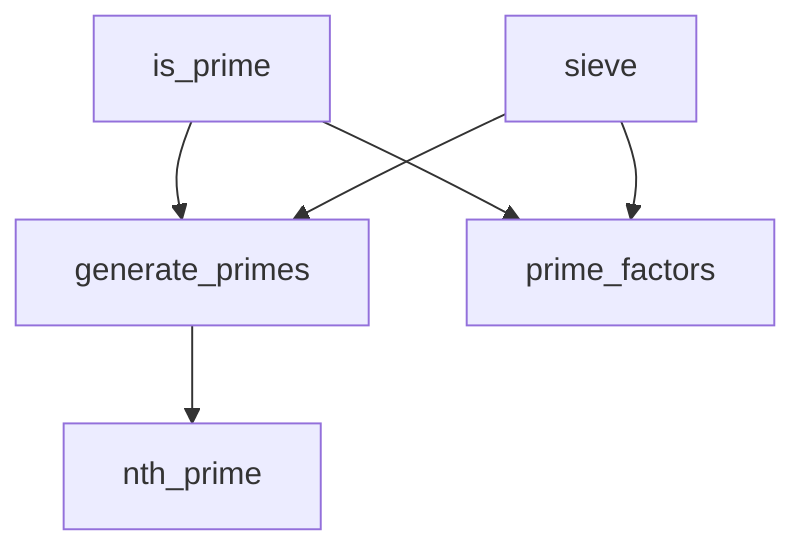

# src/euler_maths/prime.py

> Language: python | Size: 4203 bytes

## Model qwen3:8b

### 1. Purpose Summary  
This file provides a suite of tools for **prime number generation** and **primality testing**, optimized for efficiency and memory usage. It includes:  
- **Sieve algorithms** to generate all primes below a given number `N` (via list, NumPy, or Bitarray).  
- **Primality tests** for individual numbers, including deterministic checks for small values and probabilistic methods (Miller-Rabin) for larger numbers.  
- **Factorization** utilities to compute unique prime factors for all numbers below `N`.  

The implementation balances speed, memory efficiency, and correctness, catering to both small-scale and large-scale prime-related computations.

---

### 2. Key Functions/Classes and Their Collaboration  
**Core Functions:**  
1. **`primes(N: int) -> np.ndarray`**  
   - **Purpose:** Generates all primes < `N` using a **Numpy-based Sieve of Eratosthenes**.  
   - **Collaboration:** Uses NumPy arrays for memory efficiency, marking non-primes and returning indices of primes.  

2. **`primes_iter(N: int) -> Iterator[int]`**  
   - **Purpose:** Produces primes < `N` via a **Bitarray-based sieve**, using ~`N` bits (memory-efficient).  
   - **Collaboration:** Leverages Bitarray's `itersearch` to lazily yield primes.  

3. **`is_prime(n: int) -> bool`**  
   - **Purpose:** Determines if `n` is prime using **Miller-Rabin** for large `n` and **trial division** for small `n`.  
   - **Collaboration:** Uses `primes()` for small `n` (indirectly) and handles large `n` with probabilistic checks.  

4. **`prime_factors(N: int) -> np.ndarray`**  
   - **Purpose:** Computes unique prime factors for all numbers < `N` using a **sieve-like approach**.  
   - **Collaboration:** Relies on precomputed small primes and iteratively assigns factors to numbers.  

5. **`_is_prime_basic(n: int) -> bool`**  
   - **Purpose:** A **basic trial division** method for small `n` (used by `is_prime`).  
   - **Collaboration:** Serves as a fallback for small values in `is_prime`.  

**Collaboration Flow:**  
- Sieve functions (`primes`, `primes_iter`, `_primes`) generate primes for bulk operations.  
- `is_prime` handles individual checks, using `primes()` for small `n` and Miller-Rabin for large `n`.  
- `prime_factors` leverages sieve logic to compute factors efficiently.  

---

### 3. External Dependencies or APIs Used  
- **`numpy`**  
  - Used for memory-efficient prime generation (`primes`) via NumPy arrays.  
- **`bitarray`**  
  - Enables low-memory prime iteration (`primes_iter`) using bit-level operations.  
- **`random`**  
  - Provides random bases for the probabilistic Miller-Rabin test in `is_prime`.  
- **`typing`**  
  - Enables type hints for function parameters and return types.  

**Note:** The `_primes` function is deprecated due to higher memory usage and slower performance compared to NumPy/Bitarray implementations.

## Detected Imports

- import random
- import bitarray
- import numpy as np
- from typing import List, Iterator

## Function Diagram

```mermaid
graph TD
    A[is_prime] --> B[generate_primes]
    A --> C[prime_factors]
    D[sieve] --> B
    D --> C
    B --> E[nth_prime]
```
