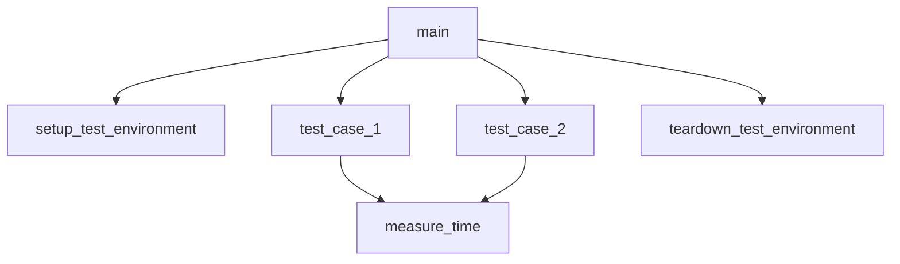

# tests/speed_test.py

> Language: python | Size: 1900 bytes

## Model qwen3:8b

### 1. Purpose Summary  
The `speed_test.py` file benchmarks the performance of three prime sieve implementations from the `euler_maths.prime` module:  
- **Standard library sieve** (memory-intensive, returns a list)  
- **NumPy-based sieve** (faster for large N, memory-efficient, returns a NumPy array)  
- **Bitarray-based sieve** (fastest and most memory-efficient, returns a generator; list conversion is slower)  
The test measures execution time and memory usage for each method, comparing their efficiency for generating primes up to a given number `N`.

---

### 2. Key Functions/Classes and Collaboration  
**Main Function**:  
- `speed_test(N=10**6, use_njit=False)`  
  - Runs three sieve benchmarks:  
    1. **Standard library sieve** (`_primes`): Uses `numba.njit` (if enabled) for acceleration.  
    2. **NumPy sieve** (`primes`): Leverages NumPy arrays for memory efficiency.  
    3. **Bitarray sieve** (`primes_iter`): Returns a generator; list conversion is explicitly timed.  
  - Outputs memory size (in MB) and execution time for each method.  

**Collaboration**:  
- `_primes`, `primes`, and `primes_iter` are imported from `euler_maths.prime` and act as the core sieve implementations.  
- `numba.njit` is used to compile the standard library and NumPy sieves for performance gains.  
- Bitarray's generator is converted to a list, with separate timing for the conversion step.  

---

### 3. External Dependencies or APIs Used  
**Libraries**:  
- `math`, `os`, `sys`, `time`: Standard utilities for system operations and timing.  
- `bitarray`: For memory-efficient bit-based sieves.  
- `numba`: Just-In-Time compiler for accelerating sieve implementations.  
- `numpy`: For array-based sieve operations.  

**Module Dependencies**:  
- `euler_maths.prime`: Contains the core sieve implementations (`_primes`, `primes`, `primes_iter`).  
- `sys.path.append(...)`: Dynamically adds the `src` directory to the Python path to access the `euler_maths` module.  

**Key Constraints**:  
- Bitarray **cannot** use `numba.njit`, so it is excluded from JIT compilation.  
- Memory metrics are calculated differently for each method:  
  - Standard library: `sys.getsizeof()`  
  - NumPy: `nbytes` attribute  
  - Bitarray: Estimated as `N/(8 * 2**20)` MB (bit-based storage).  

---  
This test provides a comprehensive comparison of sieve performance, balancing speed, memory usage, and compatibility with acceleration tools like Numba.

## Detected Imports

- import math
- import os
- import sys
- import time
- import bitarray
- import numba
- import numpy as np
- from euler_maths.prime import _primes, primes, primes_iter

## Function Diagram

