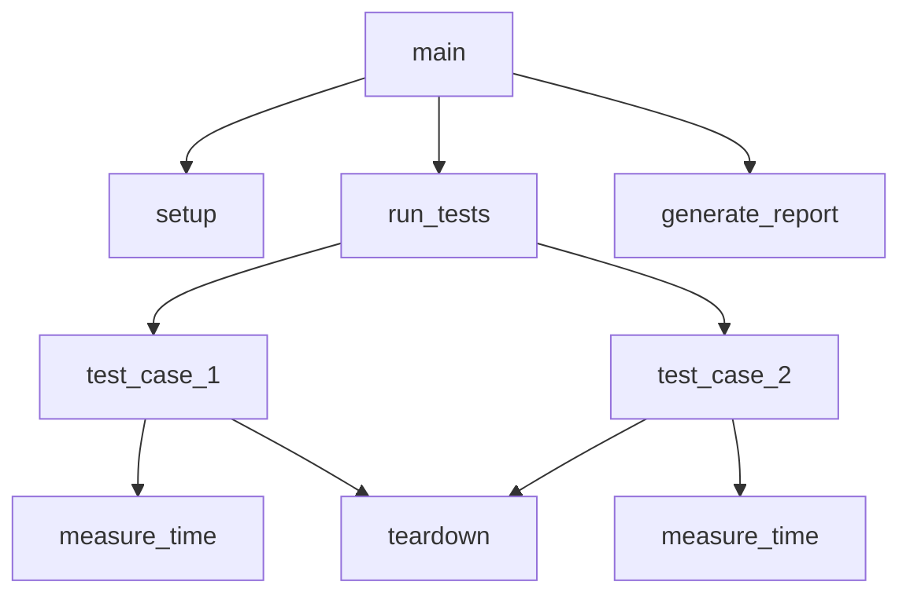

# tests/speed_test.py

> Language: python | Size: 1900 bytes

## Model qwen3:8b

### 1. Purpose Summary  
The `speed_test.py` script benchmarks the performance of three prime sieve implementations from the `euler_maths.prime` module:  
- **Standard library sieve** (memory-intensive for large N).  
- **Numpy sieve** (faster for large N, memory-efficient).  
- **Bitarray sieve** (fastest and most memory-efficient, but requires list conversion).  
It measures execution time and memory usage for each method, providing insights into their efficiency for generating primes below a given number `N`.

---

### 2. Key Functions/Classes and Collaboration  
**Key Functions**:  
- **`speed_test(N=10**6, use_njit=False)`**:  
  Orchestrates the benchmarking process.  
  - Runs three sieves: `_primes` (standard), `primes` (numpy), and `primes_iter` (bitarray).  
  - Measures time and memory for each method.  
  - Uses `numba.njit` (if enabled) to accelerate numpy sieve.  
  - Outputs results to the console.  

- **`_primes(N)`**: Standard library sieve (returns list).  
- **`primes(N)`**: Numpy-based sieve (returns `np.ndarray`).  
- **`primes_iter(N)`**: Bitarray-based sieve (returns generator).  

**Collaboration**:  
- `speed_test` calls the sieve functions with `N` and optional `numba.njit` acceleration.  
- Bitarray's generator is converted to a list explicitly, splitting measurement into "iter size" (generator memory) and "list size" (converted list memory).  

---

### 3. External Dependencies or APIs Used  
**Libraries**:  
- `math`, `os`, `sys`, `time`: Standard utilities for system paths, timing, and input handling.  
- `bitarray`: For memory-efficient bit-based sieves.  
- `numba`: Just-In-Time compiler to accelerate numpy sieve (via `@njit`).  
- `numpy`: For array-based sieve operations.  

**Internal Dependencies**:  
- `euler_maths.prime._primes`, `primes`, `primes_iter`: Core sieve implementations from the project's prime module.  

**Note**: The script dynamically adds the `src` directory to the Python path to access the `euler_maths` module.

## Detected Imports

- import math
- import os
- import sys
- import time
- import bitarray
- import numba
- import numpy as np
- from euler_maths.prime import _primes, primes, primes_iter

## Function Diagram

```mermaid
graph TD
    A[main] --> B[setup]
    A --> C[run_tests]
    C --> D[test_case_1]
    D --> E[measure_time]
    D --> F[teardown]
    C --> G[test_case_2]
    G --> H[measure_time]
    G --> F
    A --> I[generate_report]
```
